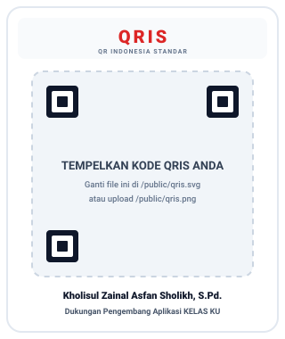

# KELAS KU
### Sistem Informasi Manajemen Sekolah & Platform Pembelajaran Digital

> Dokumentasi Arsitektur, Struktur Direktori, Alur Database, dan Panduan Penggunaan  
> Versi Rilis: 2.9.0 | Stack: React 19 + TypeScript + Vite + Express + Supabase & Firebase | Vercel Serverless Ready

---

## 1. Gambaran Umum & Arsitektur Sistem

**KELAS KU** adalah aplikasi *School Management System* (SMS) dan *Learning Management System* (LMS) modern untuk institusi pendidikan (SD, SMP, SMA/SMK) di Indonesia. Aplikasi ini mendukung Kurikulum Merdeka dan Kurikulum 2013 dengan fitur manajemen data sekolah, penilaian asesmen (Formatif, Sumatif Lingkup Materi, SAS), presensi digital, perpustakaan buku digital & LKPD, generator perangkat ajar berbasis Google Gemini AI, serta sinkronisasi multi-cloud (Supabase PostgreSQL & Firebase Firestore).

```
+-----------------------------------------------------------------------------------+
|                                 FRONTEND CLIENT                                  |
|         React 19 (TypeScript) + Vite + Tailwind CSS + Lucide Icons + Motion       |
|   +-------------------+    +--------------------+    +------------------------+   |
|   |   Portal Siswa    |    |    Portal Guru     |    |   Portal Admin/Kepsek  |   |
|   +-------------------+    +--------------------+    +------------------------+   |
|                            |  Portal Orang Tua  |                                 |
|                            +--------------------+                                 |
+------------------------------------------+----------------------------------------+
                                           |
                                     HTTP / REST API
                                           v
+-----------------------------------------------------------------------------------+
|                           BACKEND & SERVERLESS API                                |
|             Node.js + Express (Port 3000 / Vercel Serverless Function)            |
|  +--------------------+   +-----------------------+   +------------------------+  |
|  | /api/webhooks/gform|   | /api/ai/tutor         |   | /api/health            |  |
|  +--------------------+   +-----------------------+   +------------------------+  |
+---------------------+---------------------+---------------------------------------+
                      |                     |
        +-------------+-------------+       +-------------+
        |                           |                     |
        v                           v                     v
+---------------+           +---------------+     +---------------+
|   FIREBASE    |           |   SUPABASE    |     | EXTERNAL HOOK |
|   Firestore   |           | (PostgreSQL)  |     | Google Apps   |
| (Multi-Device)|           |  (Relational) |     | Script (GAS)  |
+---------------+           +---------------+     +---------------+
```

---

## 2. Pembaruan & Fitur Terkini (Versi 2.9.0)

1. **Integrasi Penuh AI Pembuat Soal**:
   - Menyatukan fungsionalitas pembuatan naskah soal berbasis Google Gemini AI, generator script **Google Apps Script**, dan **Webhook Receiver** ke dalam satu modul terpadu tanpa menu terpisah yang berulang.
2. **Kesiapan Deploy Vercel (Vercel Serverless Ready)**:
   - Menyediakan entry point `/api/index.ts` dan konfigurasi `vercel.json` sehingga backend Express dapat berjalan sebagai Vercel Serverless Function maupun di container mandiri.
3. **Optimasi Pemutusan Koneksi (Disconnect Reliability)**:
   - Memperbaiki tombol *Disconnect* dan *Reset* pada Supabase dan Firebase agar bekerja seketika tanpa terblokir dialog browser di dalam sandbox iframe.
4. **Resiliensi Webhook & Fallback Cerdas**:
   - Penanganan penerimaan data webhook Google Form dan sinkronisasi lembar nilai secara andal saat database cloud dalam proses inisialisasi.

---

## 3. Struktur Direktori Proyek

```
kelas-ku/
├── .env.example                  # Template variabel lingkungan
├── api/                          # Serverless handler (Vercel deployment)
│   └── index.ts                  # Vercel serverless entry point
├── index.html                    # Entry point dokumen HTML utama
├── metadata.json                 # Metadata platform & perizinan aplikasi
├── package.json                  # Konfigurasi dependensi dan script build
├── server.ts                     # Server Express backend & Vite middleware
├── tsconfig.json                 # Konfigurasi kompilasi TypeScript
├── vercel.json                   # Konfigurasi routing dan deployment Vercel
├── vite.config.ts                # Konfigurasi bundler Vite & styling
│
└── src/
    ├── main.tsx                  # Entry point React DOM
    ├── App.tsx                   # Navigasi & perutean berbasis peran
    ├── index.css                 # Konfigurasi styling Tailwind CSS
    ├── types.ts                  # Deklarasi tipe data, antarmuka, & enum
    │
    ├── components/               # Komponen antarmuka modular
    │   ├── Header.tsx            # Bilah navigasi atas (Profil, Notifikasi, Cloud, Tema)
    │   ├── Sidebar.tsx           # Navigasi samping menu akademik & administratif
    │   ├── Footer.tsx            # Informasi aplikasi & status sinkronisasi
    │   ├── ThemeContext.tsx      # State manager tema tampilan
    │   ├── FirebaseSyncModal.tsx # Modal sinkronisasi Google Cloud Firebase Firestore
    │   ├── FirebaseSettingsTab.tsx # Pengaturan kredensial Firebase
    │   ├── SupabaseSyncModal.tsx # Modal sinkronisasi database Supabase PostgreSQL
    │   ├── SupabaseSettingsTab.tsx # Pengaturan kredensial Supabase
    │   ├── AsesmenMatrixTable.tsx# Matriks rekapitulasi nilai formatif & sumatif
    │   ├── BukuDigitalView.tsx   # Pembaca PDF & repositori materi digital/LKPD
    │   ├── AiTutorGuruView.tsx   # Asisten AI Pedagogi Guru berbasis Gemini API
    │   ├── AiPerangkatAjarView.tsx # AI Generator TP, ATP, Promes, Prota, & Modul Ajar
    │   ├── AiGeneratorSoalView.tsx # AI Penyusun naskah soal & otomatisasi Google Form
    │   ├── GoogleWorkspaceModal.tsx # Integrasi Google Workspace (Drive, Docs, Sheets)
    │   ├── AutoLogoutManager.tsx # Pengaman auto-lock sesi tidak aktif
    │   └── IndonesianCalendar.tsx# Kalender akademik dan hari libur nasional
    │
    ├── pages/                    # Halaman portal pengguna per peran
    │   ├── Login.tsx             # Halaman autentikasi multi-peran
    │   ├── GuruDashboard.tsx     # Dasbor Guru & Wali Kelas
    │   ├── SiswaDashboard.tsx    # Portal Siswa (Tugas, Absensi, Rapor, Buku)
    │   └── OrangTuaDashboard.tsx # Portal Wali Murid (Monitoring anak)
    │
    └── services/                 # Layer data & konektivitas cloud
        ├── db.ts                 # Database controller lokal (Local Storage)
        ├── firebase.ts           # Service integrasi Firebase Firestore
        ├── firebaseClient.ts     # Inisialisasi Firebase App Client
        ├── supabase.ts           # Service integrasi Supabase PostgreSQL
        ├── supabaseClient.ts     # Inisialisasi Supabase Client
        ├── googleServices.ts     # Integrasi Google Form & Webhook
        ├── googleAuth.ts         # Otentikasi Google OAuth2
        └── googleWorkspace.ts    # Integrasi Google Drive & Dokumen Workspace
```

---

## 4. Matriks Hak Akses Pengguna

| Peran Pengguna | Halaman / Portal | Fitur Utama |
| :--- | :--- | :--- |
| **Kepala Sekolah / Admin** | `GuruDashboard` (Admin Mode) | Profil sekolah, master data (Guru, Siswa, Rombel), sinkronisasi cloud, rekapitulasi rapor, ekspor Excel/PDF. |
| **Guru / Wali Kelas** | `GuruDashboard` | Penilaian asesmen formatif/sumatif, presensi harian, pembuatan tugas Google Form, modul ajar AI, buku digital guru. |
| **Siswa** | `SiswaDashboard` | Pengerjaan tugas Google Form, rekap nilai harian, presensi mandiri, perpustakaan materi belajar digital & LKPD. |
| **Orang Tua / Wali** | `OrangTuaDashboard` | Pemantauan perkembangan belajar anak, histori presensi kehadiran, nilai rapor, dan keterbukaan tugas sekolah. |

---

## 5. Panduan Menjalankan Aplikasi

### Mode Pengembangan (Development)
```bash
npm run dev
```
Server Express dan Vite akan berjalan di alamat `http://localhost:3000`.

### Pemeriksaan Integritas Tipe Data (Lint)
```bash
npm run lint
```

### Membangun Versi Produksi (Production Build)
```bash
npm run build
npm start
```

### Deployment ke Vercel
Proyek ini sudah dilengkapi dengan konfigurasi `vercel.json` dan `/api/index.ts`. Cukup hubungkan repositori ke Vercel, lalu isi Environment Variables yang diperlukan (`GEMINI_API_KEY`, dsb.).

---

## 6. Proyek Open Source & Komunitas

Aplikasi ini berstatus **Open Source** di bawah lisensi MIT. Siapa saja dipersilakan untuk menggunakan, memodifikasi, memperluas fitur, dan mendistribusikannya kembali untuk mendukung digitalisasi dan memajukan pendidikan di seluruh Indonesia.

Kontribusi, saran perbaikan, serta *pull request* sangat terbuka bagi seluruh rekan guru, pengembang, dan praktisi pendidikan.

---

## 7. Pengembang & Dukungan

- **Pengembang Aplikasi**: **Kholisul Zainal Asfan Sholikh, S.Pd.**
- **Dukungan AI**: **Google AI Studio** & Gemini Generative AI

---

## 8. Dukungan & Donasi Pengembangan (QRIS)

Jika aplikasi ini bermanfaat bagi kegiatan belajar mengajar atau institusi sekolah Anda, Anda dapat memberikan apresiasi dan mendukung pengembangan berkelanjutan aplikasi ini melalui donasi QRIS di bawah:

<div align="center">
  <br />
  
  <!-- TEMPAT KODE QRIS: Ganti file /public/qris.svg atau upload /public/qris.png -->
  
  
  <br /><br />
  
  **Kholisul Zainal Asfan Sholikh, S.Pd.**  
  *Dukungan Pengembangan Aplikasi Pendidikan Open Source*  
  
  <br />
  
  ```text
  [ Panduan Pengisian Kode QRIS ]
  1. Simpan gambar barcode QRIS Anda dengan nama file 'qris.png' di dalam folder /public/
     ATAU
  2. Ganti nilai src pada tag  di atas dengan URL gambar QRIS Anda yang sudah diupload online.
  ```
</div>

---

## 9. Lisensi
Hak Cipta (c) 2026 **Kholisul Zainal Asfan Sholikh, S.Pd.** - Sistem Manajemen Sekolah & LMS Digital.  
Didistribusikan di bawah Lisensi MIT. Bebas digunakan dan dikembangkan untuk kemaslahatan pendidikan.
